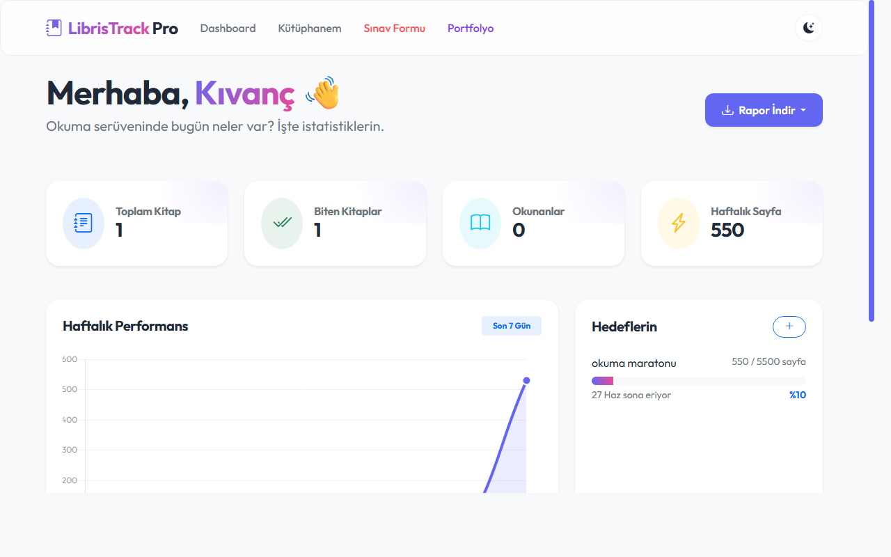
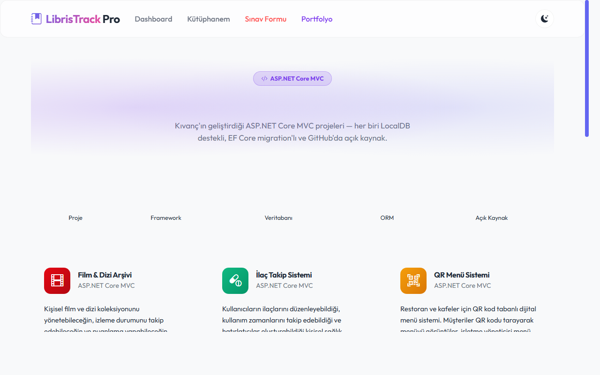

# 📚 LibrisTrack Pro - Sanal Okuma Kütüphanesi ve Okuma Takip Sistemi

LibrisTrack Pro, kitap okuma alışkanlıklarınızı profesyonelce takip etmeniz, kişisel okuma hedefleri belirlemeniz ve okuma istatistiklerinizi görselleştirmeniz için geliştirilmiş modern, şık ve kullanıcı dostu bir **ASP.NET Core 8.0 MVC** web uygulamasıdır.

Premium tasarımı, temaya duyarlı dinamik grafikleri ve gelişmiş raporlama yetenekleri ile okuma yolculuğunuzu baştan sona keyifli bir deneyime dönüştürür.

---

## ✨ Öne Çıkan Özellikler

### 1. 🌓 Göz Yormayan Gece Modu (Dark Mode)
* **Modern Entegrasyon:** CSS Değişkenleri (`:root` & `[data-theme="dark"]`) ve saf JavaScript (Vanilla JS) kullanılarak kusursuz bir karanlık mod desteği eklendi.
* **Akıllı Bellek:** Kullanıcının tema tercihi tarayıcı hafızasında (`localStorage`) saklanır, böylece sayfalar arası geçişlerde ve sonraki ziyaretlerde tercih otomatik olarak hatırlanır.
* **Görsel Uyum:** Koyu moda geçildiğinde sadece arka plan renkleri değil; kartlar, gölgeler, sınırlar ve hatta Chart.js grafikleri bile anında koyu tema renk paletine adapte olur.

### 2. 📊 Dinamik Dashboard Grafiği & Detaylı İstatistikler
* **Chart.js Entegrasyonu:** Okuma verilerinizi dinamik olarak işleyen interaktif bir çizgi grafiği (`readingChart`) entegre edilmiştir.
* **Haftalık Performans:** Son 7 gün boyunca okuduğunuz sayfa sayıları gün bazında veritabanından çekilerek grafiğe dökülür.
* **Akıllı Renk Paleti:** Grafik çizgileri ve ızgaraları, açık ve koyu tema geçişlerinde göz zevkini bozmayacak şekilde dinamik renk güncellemelerine (`getChartColors()`) sahiptir.
* **Özet İstatistik Kartları:** Toplam Kitap Sayısı, Biten Kitaplar, Aktif Okunanlar ve Haftalık Toplam Okunan Sayfa sayıları anlık olarak dashboard üzerinde gösterilir.

### 3. 📄 Hızlı ve Şık Raporlama (Excel / PDF Çıktısı)
* **Excel Çıktısı (`ClosedXML`):** Kütüphanenizde kayıtlı olan tüm kitapların ID, Başlık, Yazar, Tür, Toplam Sayfa, Okunan Sayfa ve Durum bilgilerini içeren profesyonel bir Excel tablosunu (`Kitap_Listesi.xlsx`) tek tıkla indirebilirsiniz.
* **PDF Çıktısı (`QuestPDF`):** Kütüphanenizin şık bir sayfa düzenine, özel başlığa, indigo renk vurgularına ve otomatik sayfa numaralandırmasına sahip PDF belgesini (`Kitap_Listesi.pdf`) anında oluşturup indirebilirsiniz.
* **Kapsamlı Veri Sunumu:** Her iki çıktı türünde de kitapların kaçıncı sayfasında kaldığınız ve toplam sayfa sayısı (`Okunan/Toplam`) net bir şekilde listelenir.

### 4. 🚀 Kullanıcı Dostu Onboarding & Hedef Takibi
* **Onboarding Deneyimi:** Uygulama ilk kez açıldığında kullanıcıyı şık bir karşılama ekranı karşılar. Kullanıcı adını ve aylık okuma hedefini belirleyerek sisteme hızlıca giriş yapar.
* **Kişisel Okuma Hedefleri (Goals):** Tarih aralıkları ve hedef sayfa sayısı belirleyerek özel hedefler oluşturabilirsiniz. Oturum kaydettikçe hedeflerinizdeki ilerleme yüzdesi otomatik olarak güncellenir.
* **Okuma Oturumları (Reading Sessions):** Okuduğunuz kitapların başlangıç ve bitiş sayfalarını, okuma sürelerini kaydederek kütüphanenizi canlı tutabilirsiniz.

---

## 📸 Ekran Görüntüleri

#### 1. Dashboard & İstatistikler

*(Okuma istatistikleri, haftalık performans grafiği ve aktif kitapların takibi)*

#### 2. Portfolyo Sayfası

*(Kıvanç'ın geliştirdiği 6 adet ASP.NET Core projesinin tek bir çatı altında listelendiği portfolyo sayfası)*

---

## 🛠️ Kullanılan Teknolojiler

| Katman | Teknoloji / Kütüphane | Açıklama |
| :--- | :--- | :--- |
| **Backend Framework** | `ASP.NET Core 8.0 MVC` | Güçlü, güvenli ve ölçeklenebilir MVC mimarisi. |
| **Database & ORM** | `MS SQL Server` & `EF Core` | Code-First yaklaşımı ile ilişkisel veri tabanı yönetimi. |
| **Excel Export** | `ClosedXML` | Hızlı ve güvenilir Excel dosyası (.xlsx) üretimi. |
| **PDF Export** | `QuestPDF` | Modern, şablonlu ve vektörel PDF belgesi üretimi. |
| **Grafik Kütüphanesi** | `Chart.js` | İstemci tarafında temaya duyarlı çizgi grafiği çizimi. |
| **UI Framework & Tasarım** | `Bootstrap 5` & `Bootstrap Icons` | Responsive grid sistemi ve şık bileşen kütüphanesi. |
| **Stil ve Tema Yönetimi** | `Vanilla CSS3` & `JavaScript` | Custom Properties (Değişkenler) ile pürüzsüz karanlık tema geçişi. |

---

## 💻 Kurulum ve Çalıştırma

Projeyi yerel bilgisayarınızda ayağa kaldırmak için aşağıdaki adımları sırasıyla uygulayabilirsiniz:

### 1. Ön Gereksinimler
* Bilgisayarınızda [.NET 8.0 SDK](https://dotnet.microsoft.com/download/dotnet/8.0) kurulu olmalıdır.
* Veritabanı için **LocalDB** veya **MS SQL Server** kurulu ve çalışır durumda olmalıdır.

### 2. Projeyi Klonlayın
```bash
git clone https://github.com/kullaniciadi/okumatakibisanalkutuphane.git
cd okumatakibisanalkutuphane
```

### 3. Veritabanı Ayarlarını Kontrol Edin
`appsettings.json` dosyasını açarak `DefaultConnection` bağlantı dizesinin SQL Server yapınıza uygun olduğunu doğrulayın:
```json
"ConnectionStrings": {
  "DefaultConnection": "Server=(localdb)\\mssqllocaldb;Database=LibrisTrackProDb;Trusted_Connection=True;MultipleActiveResultSets=true"
}
```

### 4. Veritabanını Oluşturun (Migrations)
Proje kök dizininde bir terminal (PowerShell veya CMD) açarak veritabanı tablolarını otomatik oluşturmak için şu komutu çalıştırın:
```bash
dotnet ef database update
```
*(Eğer Entity Framework Core CLI yüklü değilse `dotnet tool install --global dotnet-ef` ile yükleyebilirsiniz.)*

### 5. Uygulamayı Başlatın
Uygulamayı derlemek ve yerel geliştirme sunucusunda çalıştırmak için:
```bash
dotnet run
```
Konsolda yazan adresleri (örneğin `http://localhost:5000` veya `https://localhost:5001`) tarayıcınızda açarak kütüphanenizi kullanmaya başlayabilirsiniz!

---

## 📁 Proje Klasör Yapısı

* **`Controllers/`**: Uygulama mantığı ve yönlendirmelerin yönetildiği kontrolcüler (`Books`, `Home`, `Onboarding`, `Reading`).
* **`Models/`**: Entity sınıfları (`Book`, `UserProfile`, `ReadingSession`, `Goal`).
* **`Views/`**: Kullanıcı arayüz tasarımları ve Razor sayfaları.
* **`Services/`**: PDF ve Excel çıktılarını dinamik üreten `ExportService`.
* **`wwwroot/css/site.css`**: Premium glassmorphism efektleri ve Dark Mode CSS değişkenleri.
* **`wwwroot/js/site.js`**: Tema geçiş tetikleyicisi ve lokal depolama yönetimi.

---

⭐ Projeyi beğendiyseniz yıldız vermeyi unutmayın! 
